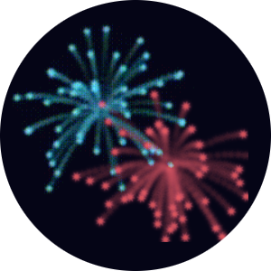

<a name="readme-top"></a>
<div align="center">
	<a href="./LICENSE">
		
	</a>
	<a href="https://github.com/LordOfTrident/nimworks/graphs/contributors">
		
	</a>
	<a href="https://github.com/LordOfTrident/nimworks/stargazers">
		
	</a>
	<a href="https://github.com/LordOfTrident/nimworks/issues">
		
	</a>
	<a href="https://github.com/LordOfTrident/nimworks/pulls">
		
	</a>
	<br><br><br>
	
	<h1 align="center">🎆 Nimworks 🎇</h1>
	<p align="center">🎉🥂 A fireworks simulation. Happy new year! 🎊🍾</p>
	<p align="center">
		<a href="#demo">View Demo</a>
		·
		<a href="https://github.com/LordOfTrident/nimworks/issues">Report Bug</a>
		·
		<a href="https://github.com/LordOfTrident/nimworks/issues">Request Feature</a>
	</p>
	<br>
</div>

<details>
	<summary>Table of contents</summary>
	<ul>
		<li><a href="#introduction">Introduction</a></li>
		<li><a href="#demo">Demo</a></li>
		<li>
			<a href="#pre-requisites">Pre-requisites</a>
			<ul>
				<li><a href="#debian">Debian</a></li>
				<li><a href="#arch">Arch</a></li>
			</ul>
		</li>
		<li><a href="#quickstart">Quickstart</a></li>
		<li><a href="#controls">Controls</a></li>
		<li><a href="#bugs">Bugs</a></li>
	</ul>
</details>

## Introduction
A fireworks simulation program i made for new year 2024 to practice the [Nim programming language](https://nim-lang.org/).

## Demo
<p align="center">
	
</p>

## Pre-requisites
Nimworks requires the following dependencies to be installed globally:
- [SDL2](https://github.com/libsdl-org/SDL)
- [SDL2/SDL_image](https://github.com/libsdl-org/SDL_image)
- [SDL2/SDL_mixer](https://github.com/libsdl-org/SDL_mixer)

### Debian
```
$ sudo apt install libsdl2-dev libsdl2-image-dev libsdl2-mixer-dev
```

### Arch
```
$ pacman -S sdl2 sdl2_image sdl2_mixer
```

## Quickstart
```sh
$ git clone https://github.com/LordOfTrident/nimworks
$ cd nimworks
$ nimble build
$ ./nimworks
```

## Controls
| Key          | Action |
| ------------ | ------ |
| Escape       | Quit  |
| Return       | Enable/disable manual fireworks cannon |
| Space        | Fire a firework in manual fireworks cannon mode |
| Left arrow   | Move fireworks cannon left |
| Right arrow  | Move fireworks cannon right |
| C            | Enable/disable city background |
| S            | Enable/disable sound |

## Bugs
If you find any bugs, please, [create an issue and report them](https://github.com/LordOfTrident/nimworks/issues).

<br>
<h1></h1>
<br>

<div align="center">
	<a href="https://nim-lang.org/">
		
	</a>
	<a href="https://github.com/nim-lang/sdl2">
		
	</a>
	<p align="center">Made with ❤️ love</p>
</div>

<p align="right">(<a href="#readme-top">Back to top</a>)</p>
